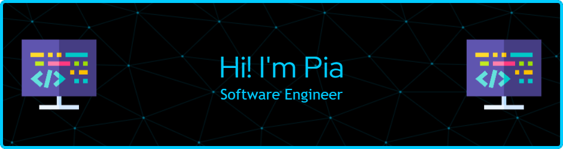

<!-- Header -->



Hi! I am Pia. Thanks for taking a look at my profile. 

<!-- Contacts -->
:mailbox: Contact me!

 
 

- 🔭 Currently learning new skills and focusing on the impact that AI/ML has on society.
- 👯 I would love to collaborate on anything that aligns with my focus, is exciting and offers a great learning experience.
- 📚 I am always learning new skills, new technology and solving problems.
- 🏆 Goal: Build solutions that are safe and equitable for all.   
- ⚡ Words I Live By: Just because it CAN be done, doesn't mean it SHOULD be done.


<!-- Skills -->
## Languages and Tools

[](#) [](#) [](#) [](#) [](#)
  

[](#) [](#) [](#)
[](#) [](#)

<!-- databases -->
[](#) [](#) 
[](#) 

<!-- testing -->
[](#)
[](#)
[](#) 

<!-- frontend  and mobile-->
[](#) [](#)  [](#) 

<!-- frontend extra -->
[](#)
[](#)
[](#) 
[](#)

<!-- css frameworks -->
[](#) [](#) [](#) 

<!-- distribution and emvironments, node versioning -->
[](#)
[](#)
[](#)

<!-- package management -->
[](#)
[](#)
[](#)

<!-- hosting -->
[](#)
[](#) [](#)

<!-- ides -->
[](#)
[](#)


 

<!-- ### Highlights -->

## Portfolio Website
[](https://piatorain.com/)

## Projects
[](https://colourmichic-cmc.com/)
[](https://github.com/Pia007/medView/)
[](https://viva-las-vegas.herokuapp.com/)
[](https://hostahealtcarehero.netlify.app/)


<!-- Stats -->
## Statistics

<p align="left">

  [](https://wakatime.com/@b3513b54-9e2d-4fc6-b997-adc0799b4502)

</p>

#### Weekly
<div style="border: 1px solid #00ccff; background-color: black; padding: 10px 0px 0px 0px">
<!--START_SECTION:waka-->

```txt
Python   15 hrs 4 mins   ███████████████████▒░░░░░   77.37 %
Text     3 hrs 26 mins   ████▒░░░░░░░░░░░░░░░░░░░░   17.64 %
JSON     57 mins         █▒░░░░░░░░░░░░░░░░░░░░░░░   04.95 %
Ezhil    0 secs          ░░░░░░░░░░░░░░░░░░░░░░░░░   00.03 %
Other    0 secs          ░░░░░░░░░░░░░░░░░░░░░░░░░   00.01 %
```

<!--END_SECTION:waka-->

<p align="left">

</p> 


